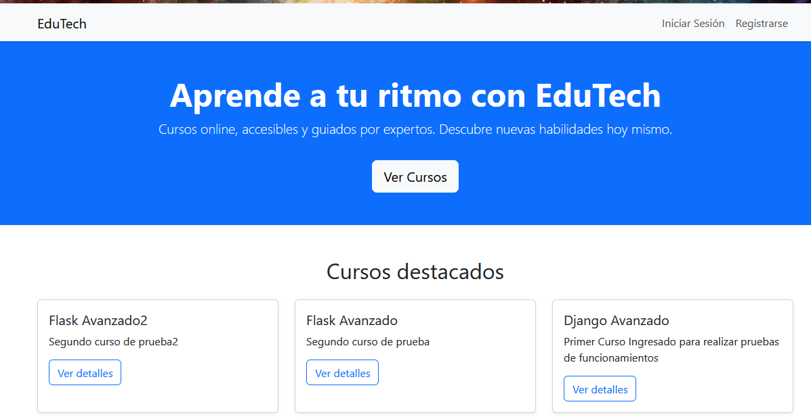
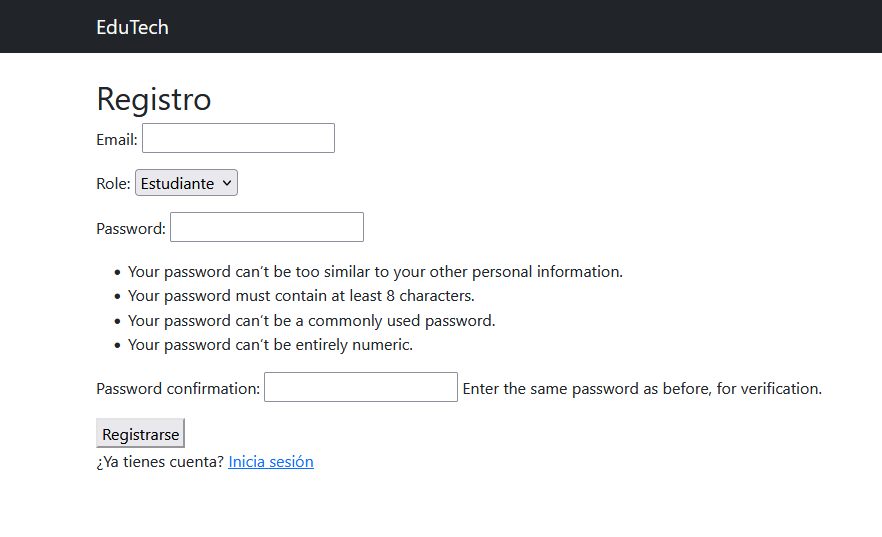
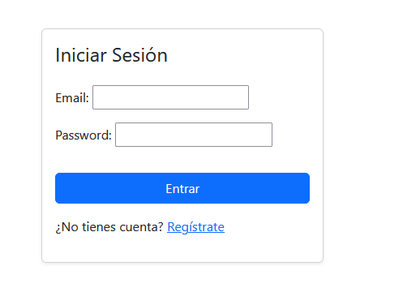
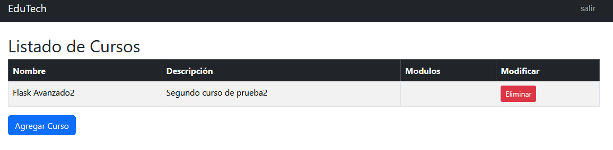
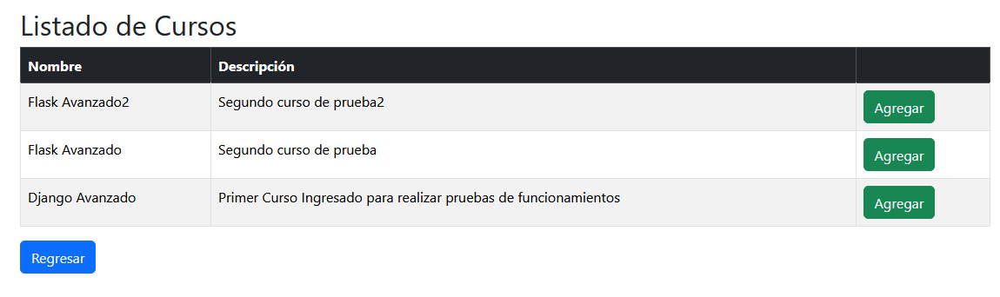
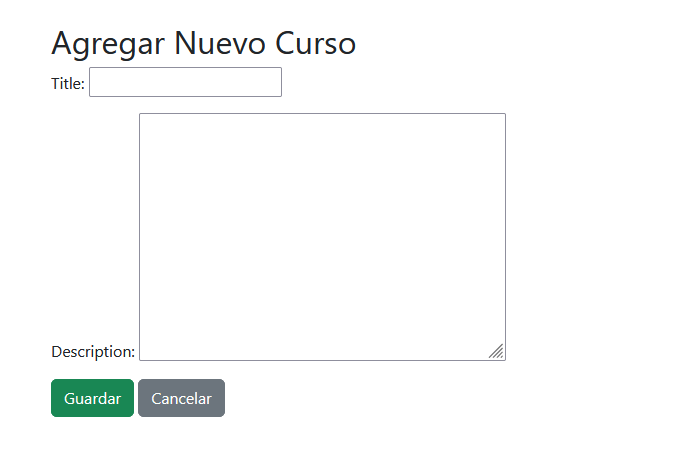

📘 Plataforma de Gestión de Cursos – Proyecto con Django

Este es un proyecto desarrollado con Django como parte de mi portafolio personal. La plataforma permite a profesores crear cursos y a estudiantes inscribirse, visualizar módulos y gestionar su progreso.

🚀 Características principales

    Registro e inicio de sesión con roles (profesor/estudiante).

    Profesores pueden:

        Crear cursos.

        Agregar módulos con título, descripción y orden.

    Estudiantes pueden:

        Ver lista de cursos.

        Inscribirse en cursos.

        Visualizar los módulos asociados a sus cursos.

🛠️ Tecnologías utilizadas

    Python 

    Django 

    SQLite

    HTML5 + BootSatrap


### 📁 Estructura del proyecto

```
course_platform/
│
├── course_platform/             
│   ├── __init__.py       
│   ├── asgi.py          
│   ├── settings.py  
│   ├── urls.py  
│   ├── wsgi.py        
│
├── courses/              # Aplicación principal
│   ├── migrations/ 
│   │   ├── __init__.py 
│   │   ├── 0001_initial.py 
│   ├── templates/        # Templates HTML personalizados
│   │   ├── courses/ 
│   │   │   ├── add_course.html 
│   │   │   ├── course_detail.html 
│   │   │   ├── course_list.html 
│   │   │   ├── coursestudent.html
│   │   │   ├── courseteacher.html
│   │   │   ├── delete-course.html
│   │   │   ├── edit_course.html
│   │   │   ├── login.html
│   │   │   ├── register.html
│   │   ├── modules/ 
│   │   │   ├── add_module.html
│   │   │   ├── delete_module.html
│   │   │   ├── edit_module.html
│   │   ├── baseindex.html.py 
│   │   ├── index.py 
│   ├── __init__.py
│   ├── admin.py
│   ├── apps.py
│   ├── forms.py
│   ├── tests.py            
│   ├── models.py         # Modelos: Curso, Módulo, CursoEstudiante
│   ├── views.py          # Vistas principales
│   ├── urls.py        
│
├── .gitignore
├── db.sqlite3
├── manage.py
└── README.md             # Este archivo
```


🔑 Roles

    Profesor: crea y edita cursos.

    Estudiante: se inscribe en cursos y consulta los módulos.

# Clona el repositorio
git clone https://github.com/AdrianEs1/course_platform.git
cd course_platform

# Crea y activa el entorno virtual
python -m venv venv
source venv/bin/activate  # En Windows usa: venv\Scripts\activate

# Instala dependencias
pip install -r requirements.txt

# Migraciones y ejecución
python manage.py makemigrations
python manage.py migrate
python manage.py runserver


📸 Capturas 
### 🖼️ Capturas de pantalla

**Página de inicio:**



**registro**



**Login**



**Lista de cursos (rol estudiante):**



**Seleccionar Curso disponible (rol estudiante):**



**Lista de cursos (rol profesor):**




